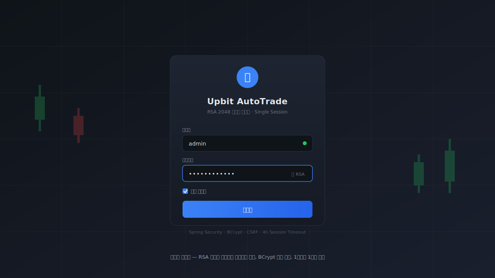
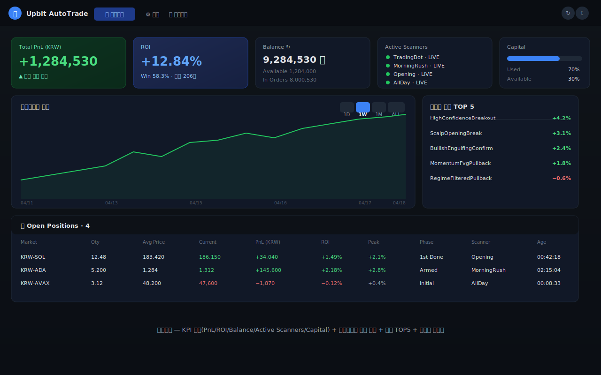
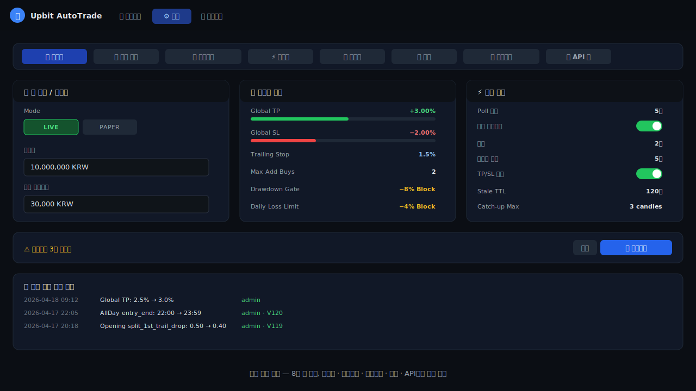
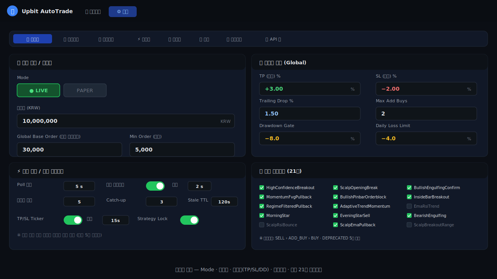
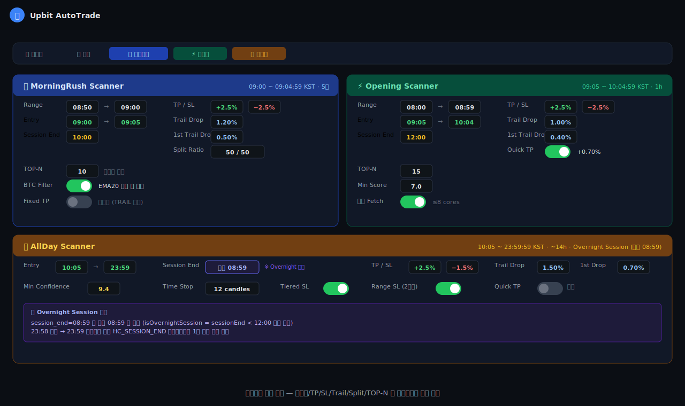
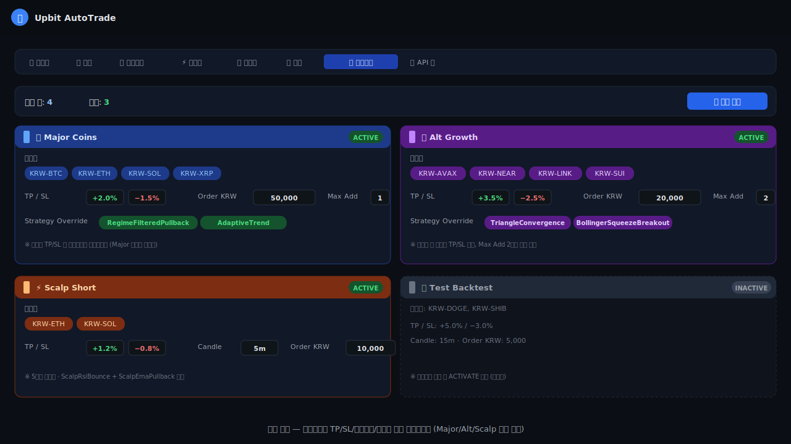
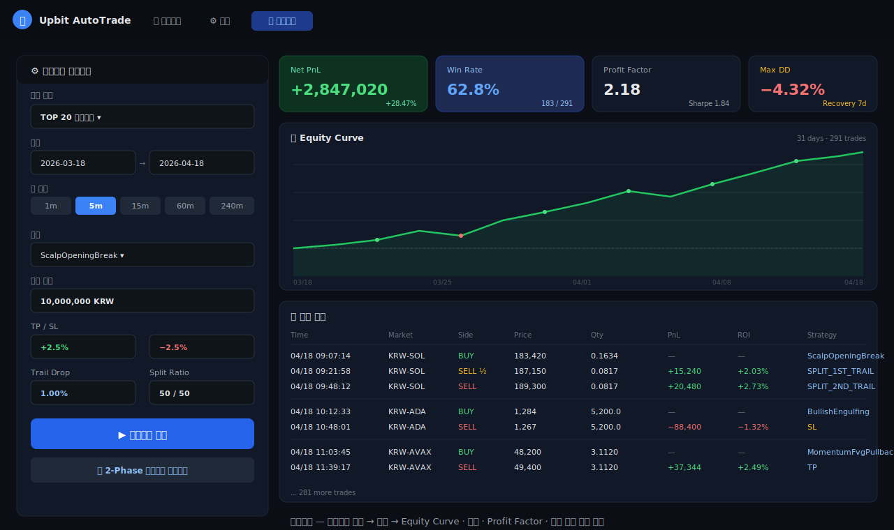
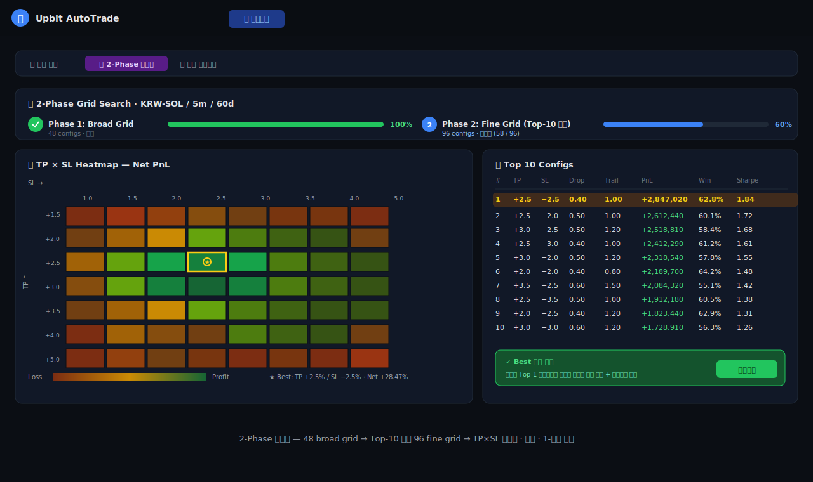

# Upbit AutoTrade Platform

> **업비트(Upbit) 암호화폐 자동매매 플랫폼** — 4개 독립 스캐너, 21개 트레이딩 전략, 실시간 WebSocket 가격 통합, Split-Exit 분할 익절, 백테스트·최적화 엔진을 갖춘 **풀스택 트레이딩 시스템**

<p align="center">
  
  
  
  
  
</p>

---

## 📌 프로젝트 개요

단순한 자동매매 스크립트가 아니라, **실시간 WebSocket 기반 이벤트 구동 아키텍처**와 **24시간 무인 운영**을 목표로 설계한 본격적인 트레이딩 플랫폼입니다.

- 🏛️ **4개 독립 스캐너**가 시간대별로 바톤을 이어받으며 24시간 시장을 감시
- ⚡ **SharedPriceService**: 4개 커넥션 × 50마켓 WebSocket을 단일 서비스에서 관리 (리스너 패턴)
- 🛡️ **Graceful Restart**: 앱 재시작 시 미체결 주문 동기화 + 포지션 peak 복원으로 연속성 보장
- 🎯 **Split-Exit**: 1차(50%) TRAIL → 2차(50%) TRAIL 분할 익절 + 2차 Breakeven SL
- 🧪 **TDD**: 405개 단위·통합·시나리오 테스트 (스캐너 시나리오 테스트 포함)
- 📊 **백테스트 + 2-Phase 최적화**: 과거 데이터 기반 전략·파라미터 검증

> ⚠️ 교육·연구 목적 프로젝트입니다. 실거래는 본인 책임이며, 손실 가능성을 인지한 상태에서만 사용하세요.

---

## 🖼 스크린샷

### 1. 로그인 — RSA-2048 비대칭 암호화 로그인

<p align="center">
  
</p>

- **RSA-2048 공개키**를 프론트에서 먼저 fetch한 뒤, 비밀번호를 암호화해서 전송
- 서버 `RsaKeyHolder`가 개인키로 복호화 후 `BCrypt`로 검증
- **사용자당 단일 세션 정책** — 다른 기기 로그인 시 기존 세션 강제 종료
- **4시간 세션 타임아웃** + CSRF Cookie 기반 보호

### 2. 대시보드 — 실시간 KPI + 포지션 모니터링

<p align="center">
  
</p>

| 영역 | 설명 |
|------|------|
| **봇 제어 패널** | 4개 스캐너(메인봇·MR·Opening·AllDay) 독립 START/STOP 토글 |
| **KPI 카드** | 총 자산·실현 P&L·ROI·승률·일일 손익 (2~5초 폴링) |
| **보유 포지션** | 마켓/수량/평균가/현재가/미실현PnL/추가매수 횟수/진입 전략 |
| **거래 이력** | 시간·마켓·액션·전략·신뢰도·체결가·PnL (페이지네이션 + 필터) |
| **Decision Guard** | 주문 차단·경고 사유 200건 링버퍼 (왜 매수 안 했는지 추적) |
| **차트 팝업** | 클릭 시 해당 마켓 캔들스틱 + 매매 포인트 시각화 |

### 3. 설정 — 멀티 스캐너 + 전략 그룹 관리

<p align="center">
  
</p>

#### 3-1. 글로벌 설정
<p align="center">
  
</p>

- PAPER ↔ LIVE 모드 전환 (Upbit API 키 연결 테스트 UI 포함)
- 자본금·수수료·슬리피지·낙폭 차단기·일일 손실 한도

#### 3-2. 스캐너별 설정 (MorningRush / Opening / AllDay)
<p align="center">
  
</p>

- 각 스캐너 독립: 진입·세션 시간대, TOP-N 개수, TP%, SL%, 신뢰도, Split-Exit 비율/drop
- 실시간 편집 → DB 즉시 반영 (서버 재시작 불필요)

#### 3-3. 전략 그룹 + 프리셋
<p align="center">
  
</p>

- 마켓셋별 독립 전략·리스크 운영 (예: BTC는 공격형, ETH는 보수형)
- **프리셋 시스템**: 상승/횡보/하락 × 공격/안정 6종 원클릭 적용

### 4. 백테스트 — 과거 데이터 기반 전략 검증

<p align="center">
  
</p>

- 기간 지정(From/To) + 전략 그룹 구성 + 캔들 인터벌 선택
- **결과 KPI**: 총 수익·ROI·거래 수·승률·TP/SL/패턴 매도 비율
- 거래 기록 + 캔들차트에 매매 포인트 오버레이

### 5. 최적화 — 2-Phase 파라미터 탐색

<p align="center">
  
</p>

- TP·SL·추가매수·신뢰도 조합 **수백~수천 케이스** 병렬 백테스트
- Phase 1: 광범위 탐색 → Phase 2: 상위 케이스 세밀화
- 기간별 메트릭 저장으로 **과적합 탐지** 가능

---

## 🏛️ 아키텍처

### 시스템 구성도

```
┌───────────────────────────────────────────────────────────────────┐
│                         Client (Browser)                           │
│  Thymeleaf HTML + Vanilla JS + Lightweight Charts (TradingView)   │
└────────────────────────┬──────────────────────────────────────────┘
                         │ REST (CSRF Cookie + RSA Login)
┌────────────────────────▼──────────────────────────────────────────┐
│                   Spring Boot 2.7 (Java 17)                        │
│  ┌──────────────┬──────────────┬──────────────┬──────────────┐   │
│  │ TradingBot   │ MorningRush  │ Opening      │ AllDay       │   │
│  │ (메인봇)      │ Scanner      │ Scanner      │ Scanner      │   │
│  └──────┬───────┴──────┬───────┴──────┬───────┴──────┬───────┘   │
│         └──────────────┴───────┬──────┴──────────────┘           │
│                                │                                   │
│                    ┌───────────▼──────────┐                       │
│                    │  SharedPriceService  │  (WebSocket Hub)      │
│                    │  4 conns × 50 markets│                       │
│                    └───────────┬──────────┘                       │
│                                │                                   │
│  ┌─────────────────────────────┴─────────────────────────────┐   │
│  │  Strategy Layer (21 strategies)                             │   │
│  │   - BUY/SELL/ADD_BUY 우선순위 기반 평가                      │   │
│  │   - Signal Confidence 0~10 스코어링                         │   │
│  └──────────────────────────┬────────────────────────────────┘   │
│                             │                                     │
│  ┌──────────────────────────▼────────────────────────────────┐   │
│  │  Order Execution Layer                                      │   │
│  │   PAPER: 슬리피지/수수료 시뮬레이션                         │   │
│  │   LIVE : UpbitPrivateClient (JWT HS512 + SHA512 hash)      │   │
│  └──────────────────────────┬────────────────────────────────┘   │
│                             │                                     │
│  ┌──────────────────────────▼────────────────────────────────┐   │
│  │  Persistence — JPA + Flyway 120 migrations                  │   │
│  │   Position / OrderLog / TradeLog / StrategyState / ...     │   │
│  └─────────────────────────────────────────────────────────────┘ │
└───────────────────────────────────────────────────────────────────┘
                                │
                                ▼
            ┌────────────────────────────────────┐
            │  Upbit API   │  MySQL 8 / H2       │
            │  (REST + WS) │  (Flyway migrated)  │
            └────────────────────────────────────┘
```

### 스캐너 시간대 분담 (24시간 연속 커버)

```
 00:00                    09:00                                      24:00
   │                        │                                          │
   │   AllDay (어제) session │                                          │
   │ ← overnight 08:59 종료 │   ↙ MorningRush (09:00~09:04:59)         │
   ├────────────────────────┼──┬──────────────────────────────────────┤
   │                        │  │  Opening (09:05~10:04:59)            │
   │                        │  └──┬───────────────────────────────────┤
   │                        │     │  AllDay (10:05~23:59:59)          │
   │                        │     └───────────────────────────────────┤
   │                        │                                          │
   └────────────────────────┴──────────────────────────────────────────┘
```

---

## 🎯 스캐너·전략 상세

### 🟣 ① 메인 TradingBot (타겟 전략)

특정 마켓(예: KRW-ETH, KRW-NEAR)을 **타겟팅**하여 캔들 종가 기준으로 정교하게 매매. 전략 그룹별 독립 파라미터.

| 항목 | 값 |
|------|------|
| 운용 방식 | 캔들 종가 경계 스케줄링 (2초 버퍼 + 최대 5회 재시도) |
| 캔들 인터벌 | 5분/15분/30분/60분/240분 선택 |
| 전략 | 그룹당 최대 4개 (SELL > ADD_BUY > BUY 우선순위) |
| TP/SL | 그룹별 독립 오버라이드 + 트레일링 |
| 리스크 | 전략 락(진입 전략만 청산) + 최소 신뢰도 + 타임스탑 |
| 동시 실행 | 멀티 전략 그룹 병렬 평가 |

**🔑 핵심 기능**
- **캐치업 로직**: 서버 지연·네트워크 이슈로 놓친 최대 3캔들 자동 보정
- **Stale Entry TTL**: 진입 시그널 발생 후 120초 경과 시 매수 차단 (지연 회피)
- **Decision Guard**: 주문 차단·경고 사유를 200건 링버퍼에 기록, UI 실시간 조회
- **Graceful Restart**: 재시작 시 미체결 주문·포지션 자동 동기화

---

### 🟠 ② MorningRush Scanner (09:00 ~ 09:04:59)

한국 장 개장 직후 5분간 폭발하는 **갭상승 코인**을 포착. 08:50~09:00 프리마켓에서 range/변동성 사전 수집.

| 항목 | 값 |
|------|------|
| 운용 시간 | 레인지 수집 08:50 → 매수 09:00~09:04:59 → 세션 종료 10:00 |
| 타겟 | TOP-N 거래량 상위 50개 + 사용자 보유 코인 제외 |
| 진입 조건 | 09:00 갭 상승 + 볼륨 surge + HC 스코어 ≥ 7.0 |
| Split-Exit | TP 1.5% armed → peak 추적 → drop 0.5% 1차 매도 (50%) → drop 1.2% 2차 매도 |
| SL | Tight 2.5% / Wide 3.5% (15분 경과 후 완화) |
| 최대 포지션 | 4개 |

**🔑 설계 포인트**
- **프리마켓 range 수집 철학**: 개장 5분 매수를 위해 미리 변동성·거래대금 프로필 구축 → 09:00 정시 즉시 스캔 가능
- **isEntryPhase 부등호**: `[entry_start, entry_end)` 반개구간 적용 (분 단위 반올림 고려)

---

### 🔵 ③ Opening Scanner (09:05 ~ 10:04:59)

1시간 동안 **장 초반 모멘텀 돌파** 감지. BTC EMA20 방향 필터 + 레인지 돌파 + 확인 카운트.

| 항목 | 값 |
|------|------|
| 운용 시간 | 레인지 08:00~08:59 → 매수 09:05~10:04:59 → 청산 12:00 |
| 타겟 | TOP-15 거래량 상위 (병렬 캔들 페칭, FixedThreadPool ≤8코어) |
| 필터 | BTC EMA20 하회 시 전체 매수 차단 (시장 역행 회피) |
| 진입 조건 | 레인지 상단 돌파 + 500ms 내 중복 제거 + 신고가 확인 |
| Split-Exit | 폭발적 돌파 특성 → **타이트** drop (0.4 / 1.0) |
| Quick TP | 0.70% 도달 시 5초 간격 즉시 익절 보조 |

**🔑 설계 포인트**
- **BTC 방향 필터**: 알트코인은 BTC에 종속되는 특성 활용
- **병렬 캔들 페칭**: 15개 마켓 × 1분봉 동시 조회 (CompletableFuture + ExecutorService)
- **500ms 중복 방지**: 틱 간격 제어로 동일 가격 이벤트 재처리 차단

---

### 🟢 ④ AllDay Scanner (10:05 ~ 23:59:59, session_end 익일 08:59)

나머지 시간대를 담당. 트렌드 추종형으로 **관대한** drop 값 (0.7 / 1.5).

| 항목 | 값 |
|------|------|
| 운용 시간 | 매수 10:05~23:59 → 세션 종료 다음날 08:59 (overnight) |
| 전략 | HighConfidenceBreakoutStrategy (6-Factor 스코어링 ≥ 9.4) |
| 필터 | Volume Surge + Daily Change + RSI + EMA21 Slope + Body Quality + New High |
| 리스크 | 티어드 SL (Wide → Tight 경과 시간별 전환) + 타임스탑 12캔들 |
| WS 실시간 | WebSocket 이벤트 스레드에서 즉시 TP/SL 판정 (`checkRealtimeTpSl`) |
| Split-Exit | 트렌드 지속 고려 → **관대한** drop (0.7 / 1.5) |

**🔑 설계 포인트**
- **Overnight Session**: `session_end < 12:00` 조건으로 자정 넘김 판정 → 23:58 매수건도 다음날 08:59까지 보호
- **실시간 DB 영속화**: WebSocket 이벤트 스레드가 peak 갱신, mainLoop가 0.3% 임계 초과 시 DB save (경쟁 최소화)
- **HighConfidence 6-Factor**: 예측력 없는 팩터(MACD/ADX/ATR) 제거, 10일 백테스트로 검증된 팩터만 사용

---

## 📦 트레이딩 전략 (21개)

### 캔들 패턴 기반 (5개)

| # | 전략 | 방향 | 권장 봉 | 특징 |
|---|------|------|---------|------|
| 1 | BullishEngulfingConfirm | BUY | 240m | 하락→상승 장악형 + 확인봉 |
| 2 | BearishEngulfing | SELL | 240m | 상승→하락 장악형, 보유 시 청산 |
| 3 | MomentumFvgPullback | BUY | 240m | 장대양봉 후 FVG(Fair Value Gap) 되돌림 |
| 4 | BullishPinbarOrderblock | BUY | 240m | 아래꼬리 핀바 + 지역 저점 지지 |
| 5 | InsideBarBreakout | BUY | 240m | Mother 범위 압축 → 상단 돌파 |

### 삼법·별 패턴 (4개)

| # | 전략 | 방향 | 권장 봉 | 특징 |
|---|------|------|---------|------|
| 6 | ThreeMethodsBearish | SELL | 60m | 하락 삼법형 |
| 7 | MorningStar | BUY | 240m | 하락 끝 반전 (음봉→도지→양봉) |
| 8 | EveningStarSell | SELL | 240m | 상승 끝 반전, 보유 시 청산 |
| 9 | ThreeBlackCrowsSell | SELL | 60m | 3연속 음봉 + 거래량 필터 |

### 지표 기반 자급자족 (7개)

| # | 전략 | 권장 봉 | 특징 |
|---|------|---------|------|
| 10 | RegimeFilteredPullback | 60m | EMA200/50 정렬 + ADX>18 + RSI/BB + ATR TP/SL |
| 11 | AdaptiveTrendMomentum | 60m | 5중 확인 + 샹들리에 엑시트 |
| 12 | EmaRsiTrend | 60m | 풀백/돌파 두 모드, BUY-ONLY |
| 13 | ThreeMarketPattern | 60m | 박스권 → 이중 가짜돌파 → 신고가 돌파 |
| 14 | BollingerSqueezeBreakout | 60m | 밴드 수축→확장→상단 돌파 |
| 15 | TriangleConvergence | 60m | 삼각수렴 → 추세선 돌파 |
| 16 | MultiConfirmMomentum | 30~60m | 3필수 + 5보너스 = 고확신 스코어 ≥ 6.5 |

### 스캘핑 (5개)

| # | 전략 | 권장 봉 | 특징 |
|---|------|---------|------|
| 17 | ScalpRsiBounce | 5m | RSI(7)<28 + BB하단 + 양봉 → BB중간 도달 |
| 18 | ScalpEmaPullback | 5m | EMA8>21 + 터치 풀백 + MACD>0 |
| 19 | ScalpBreakoutRange | 15m | 20봉 박스권 → 거래량 1.5배 돌파 |
| 20 | ScalpOpeningBreak | 5m | 08:00~08:59 레인지 → 09:05 돌파, 12:00 청산 |
| 21 | HighConfidenceBreakout | 5m | 6-Factor 스코어링 ≥ 9.4 (AllDay 전용) |

---

## 🛠 기술 스택

### Backend

| 구분 | 기술 | 버전 | 역할 |
|------|------|------|------|
| Language | Java | 17 | 메인 언어 |
| Framework | Spring Boot | 2.7.18 | 웹·DI·스케줄러 |
| ORM | Spring Data JPA + Hibernate | 5.6.x | 영속성 |
| Migration | Flyway | 8.5.13 | 스키마 버전 관리 (**V1~V120**) |
| Security | Spring Security + BCrypt + RSA-2048 | - | 인증·세션 |
| Auth Token | JJWT | 0.11.5 | Upbit API JWT (HS512) |
| Encryption | AES-GCM | - | Upbit API 키 암호화 저장 |
| DB | MySQL / H2 | 8.0 / 2.1 | 프로덕션 / 로컬 |
| HTTP | RestTemplate + OkHttp | - | REST / WebSocket |
| Template | Thymeleaf | - | 서버 사이드 렌더링 |
| Build | Maven | 3.9 | 의존성·패키징 |

### Frontend

| 구분 | 기술 | 역할 |
|------|------|------|
| UI | Thymeleaf + Vanilla JS | 프레임워크 의존 없음 — 빠른 로딩·저 메모리 |
| Chart | Lightweight Charts (TradingView) | 캔들스틱 + 매매 포인트 |
| CSS | 순수 CSS + CSS Variables | 다크/라이트 테마 토글 |
| Icons | SVG inline | 외부 아이콘 CDN 없음 |
| Build | None | 번들러·transpiler 미사용 (즉시 수정·즉시 반영) |

### Infra

| 구분 | 기술 |
|------|------|
| 호스팅 | AWS EC2 (Amazon Linux 2, ARM64) |
| SSL | nginx reverse proxy + Let's Encrypt |
| 도메인 | mkgalaxy.kr |
| 배포 | bash 스크립트 (`deploy.sh`) — 로컬 빌드 → SCP → PID 기반 shutdown/startup |
| 로그 | 파일 로테이션 (`logs/autotrade.log`) |

---

## 📂 프로젝트 구조

### Backend (`src/main/java/com/example/upbit/`)

```
├── UpbitAutotradeApplication.java          # 진입점
├── api/                                     # REST DTO
├── backtest/                                # 백테스트 엔진 (5개 서비스)
│   ├── BacktestService.java                 #   오케스트레이션
│   ├── BacktestSimulator.java               #   캔들 단위 시뮬레이터
│   ├── TradingEngine.java                   #   매매 실행기
│   └── BatchOptimizationService.java        #   2-Phase 파라미터 탐색
├── bot/                                     # 트레이딩 봇 코어 (9개 서비스)
│   ├── TradingBotService.java               #   메인 봇 (타겟 전략)
│   ├── MorningRushScannerService.java       #   09:00~09:04:59 스캐너
│   ├── OpeningScannerService.java           #   09:05~10:04:59 스캐너
│   ├── OpeningBreakoutDetector.java         #   Opening WS 실시간 판정기
│   ├── AllDayScannerService.java            #   10:05~23:59:59 + overnight
│   ├── AutoStartRunner.java                 #   부팅 시 자동 시작
│   ├── HourlyTradeThrottle.java             #   시간당 매매 제한
│   └── SharedTradeThrottle.java             #   다중 스캐너 공통 쓰로틀
├── config/                                  # 설정 POJO (Properties)
├── dashboard/                               # 자산 요약 서비스
├── db/                                      # JPA 엔티티 + Repository (13 테이블)
│   ├── PositionEntity.java                  #   peak_price, armed_at (V118)
│   ├── OrderLogEntity.java                  #   멱등성 키
│   ├── TradeLogEntity.java                  #   체결 이력
│   ├── *ScannerConfigEntity.java            #   3개 스캐너 설정 (싱글톤)
│   └── ...
├── market/                                  # 캔들·마켓·티커
│   ├── CandleService.java                   #   Upbit 캔들 조회 (캐시)
│   ├── SharedPriceService.java              #   🔑 WebSocket 통합 허브
│   └── UpbitMarketCatalogService.java       #   TOP-N 마켓 + 유저 보유 제외
├── security/                                # 6개 서비스 (RSA, AES, Auth)
├── strategy/                                # 21개 전략 + 기술적 지표
│   ├── Indicators.java                      #   EMA/RSI/MACD/ATR/ADX/BB
│   ├── CandlePatterns.java                  #   핀바/엥걸핑/하라미 등
│   ├── StrategyType.java                    #   enum (isSellOnly/isSelfContained/isDeprecated)
│   └── *Strategy.java                       #   21개 구현체
├── trade/                                   # 주문 실행 (PAPER/LIVE)
├── upbit/                                   # Upbit API 클라이언트
│   ├── UpbitPrivateClient.java              #   주문·잔고 (JWT)
│   └── UpbitAuth.java                       #   HS512 + SHA512 hash
└── web/                                     # 13개 컨트롤러
```

### Frontend (`src/main/resources/`)

```
├── application.yml                          # 메인 프로필
├── application-h2.yml                       # 로컬 H2
├── application-mysql.yml                    # 프로덕션 MySQL
├── db/migration/                            # Flyway 120개 SQL
│   ├── V1__init.sql
│   ├── ...
│   └── V120__scanner_time_windows.sql       # 최신
├── templates/                               # Thymeleaf
│   ├── login.html                           #   RSA 로그인
│   ├── dashboard.html                       #   메인 대시보드
│   ├── settings.html                        #   전체 설정
│   └── backtest.html                        #   백테스트 UI
└── static/
    ├── css/
    │   └── autotrade.css                    # 다크/라이트 테마
    └── js/
        ├── autotrade-common.js              # 공통 유틸 + CSRF
        ├── dashboard.js                     # 실시간 폴링 + 차트
        ├── settings.js                      # 설정 폼 + 프리셋
        └── backtest.js                      # 백테스트 실행·결과
```

---

## ⚡ 기술적 하이라이트 (포트폴리오 어필 포인트)

### 1. SharedPriceService — WebSocket 허브 패턴

Upbit WebSocket은 커넥션당 15개 코인 제한. 50개 코인 실시간 시세를 받으려면 4개 커넥션 필요.
**스캐너 4개가 각자 WebSocket을 열면 16개 커넥션 + 중복 구독**이 됨.

해결: `SharedPriceService`가 단일 허브로 4개 커넥션을 관리하고, 스캐너들은 `PriceUpdateListener`를 등록해 이벤트를 받음.

```java
sharedPriceService.addGlobalListener(priceListener);
sharedPriceService.ensureMarketsSubscribed(markets);
```

- 연결 수 **75% 감소** (16 → 4)
- 중복 구독 제거
- 재연결·alive 체크 중앙화

### 2. Split-Exit 분할 익절

기존: TP 도달 → 100% 매도 (수익을 다 실현했는데 이후 폭등하면 기회 상실)

개선: **TRAIL armed → peak 추적 → drop% 도달 시 50% 매도 → 남은 50%는 더 관대한 TRAIL로 모멘텀 수확**

```
매수 → +1.5% armed → peak 추적 → drop 0.5% → 50% 매도 (1차)
                                           ↓
                              peak 재추적 → drop 1.5% → 50% 매도 (2차)
                                           ↓
                              OR BEV(Break-Even) SL → 즉시 매도
```

3개 스캐너 **전략별 drop 차별화**:
- Opening: 0.4 / 1.0 (타이트 — 폭발적 돌파 특성)
- MR: 0.5 / 1.2 (현행)
- AllDay: 0.7 / 1.5 (관대 — 트렌드 추종)

### 3. Peak 영속화 (V118)

**문제**: 앱 재시작 시 in-memory peak 유실 → TP_TRAIL 재무장 지연

해결: `position.peak_price` + `position.armed_at` 컬럼 추가 + 재시작 시 DB에서 복원

```java
// V118 DB-first restoration
if (dbPeak != null && dbPeak > 0) {
    recPeak = dbPeak;
    recArmed = (dbArmed != null && dbArmed);
} else {
    // V115 fallback: 현재가 재판정
    recPeak = Math.max(avgP, currentPrice);
}

// 0.3% 임계 영속화 (DB write 최소화)
if ((memPeak - dbPeak) / avgPrice * 100.0 >= 0.3) {
    position.setPeakPrice(BigDecimal.valueOf(memPeak));
    positionRepo.save(position);
}
```

### 4. Decision Guard — 200건 링버퍼

"왜 매수 안 했는지?"를 UI에서 즉시 확인할 수 있어야 함.

```java
public enum DecisionType {
    BUY_BLOCKED_MAX_POSITIONS,
    BUY_SKIPPED_LOW_SCORE,
    WS_SURGE_OUTSIDE_ENTRY,
    // ...
}
```

- 마지막 200건을 메모리 링버퍼에 보존
- UI에서 필터·검색 가능
- 운영 중 문제 추적 시간 대폭 단축

### 5. Flyway 120개 마이그레이션 — 스키마 진화 관리

운영 중인 시스템의 스키마를 안전하게 진화시키기 위한 Flyway 기반 버전 관리.

주요 마일스톤:
- V1~V50: 초기 스키마 + 기능 누적
- V90~V97: E2E 테스트용 마이그레이션
- V109: AllDay 매도 구조 재설계 (TP_TRAIL + 티어드 SL)
- V111~V116: Split-Exit 스키마·값 진화
- V118: peak_price / armed_at 컬럼 추가
- V119: 스캐너별 drop 차별화
- V120: 시간대 재조정 + overnight session

### 6. TDD — 405개 테스트

```
├── 단위 테스트
│   ├── Indicators 테스트 (EMA/RSI/MACD/...)
│   └── 전략별 시그널 판정 테스트 (21개 전략)
├── 통합 테스트
│   ├── SpringBootTest (컨텍스트 로딩)
│   └── JPA Repository 테스트
└── 시나리오 테스트 (스캐너별)
    ├── OpeningDetectorSplitExitTest (S01~S08 + V115 N1~N11 + V118-1~5)
    ├── MorningRushSplitExitTest
    ├── MorningRushTpSlTest
    ├── AllDayScenarioIntegrationTest
    ├── AllDaySplitExitScenarioTest
    ├── AllDaySurgeBuyCycleTest
    ├── AllDayTieredSlScenarioTest
    └── AllDayWsTpTest
```

시나리오 테스트는 실제 스캐너 동작을 재현 — 매수→peak 갱신→1차 매도→2차 매도→BEV SL 등.

---

## 🛡 안전장치 (Safety Features)

| 장치 | 설명 |
|------|------|
| **멱등성 키** | 주문 중복 방지 (같은 마켓·수량·시각 → 동일 키) |
| **주문 테스트** | LIVE 모드 최초 진입 전 `/v1/orders/test` 사전 호출 |
| **최대 낙폭 차단기** | 자본 손실률 초과 시 신규 진입 차단 |
| **일일 손실 한도** | 당일 손실률 초과 시 진입 차단 |
| **시간당 매매 제한** | 동일 마켓 과도 매매 방지 (`HourlyTradeThrottle`) |
| **보유 코인 제외** | 사용자 보유 코인은 스캐너 대상에서 자동 제외 |
| **Stale Entry TTL** | 시그널 발생 후 120초 경과 시 진입 차단 |
| **첫 틱 매도전용** | 재시작 직후 첫 틱은 매도만 허용 (잘못된 매수 차단) |

---

## 🚀 Quick Start

### 요구사항
- JDK 17
- Maven 3.9+
- (선택) MySQL 8 — 프로덕션용, 없으면 H2 사용

### 로컬 실행

```bash
# 빌드
mvn clean package -DskipTests

# 실행 (H2 기본)
java -jar target/upbit-autotrade-1.0.0.jar

# 최초 관리자 계정
java -jar target/upbit-autotrade-1.0.0.jar --add-user=admin:yourpassword

# 접속
open http://localhost:8080
```

### MySQL 프로필

```bash
java -jar target/upbit-autotrade-1.0.0.jar \
  --spring.profiles.active=mysql \
  --spring.datasource.url=jdbc:mysql://localhost:3306/upbitbot \
  --spring.datasource.username=upbitbot \
  --spring.datasource.password=upbitbot
```

### 배포 (AWS EC2)

```bash
# deploy.sh (로컬 빌드 → SCP → PID 기반 재시작)
./deploy.sh
```

---

## 🧪 테스트 실행

```bash
# 전체 테스트
mvn test

# 특정 스캐너 시나리오만
mvn test -Dtest=OpeningDetectorSplitExitTest
mvn test -Dtest=AllDaySplitExitScenarioTest

# 백테스트 (Node.js 헬퍼 — b안)
node backtest_allday.js
```

---

## 📊 프로젝트 통계

| 항목 | 값 |
|------|------|
| Java 소스 파일 | 130+ |
| 전략 파일 | 36 (21 활성 + 5 폐기 + 10 지원) |
| Flyway 마이그레이션 | 120 |
| 테스트 | 405 통과 |
| 프론트 JS | 6 파일 (번들러 없음) |
| CSS | 2 파일 (1 메인 + 1 테마) |
| HTML 템플릿 | 5 페이지 |
| DB 테이블 | 13 |
| REST API 엔드포인트 | 40+ |

---

## 🎓 학습 포인트

이 프로젝트로 얻은 경험:

1. **실시간 이벤트 처리**: WebSocket 수천 tick/s 중 의미있는 시그널 필터링
2. **동시성 제어**: mainLoop 스레드 + WS 리스너 스레드 간 `ConcurrentHashMap` + `double[]` 패턴
3. **상태 머신 설계**: TRAIL armed → peak → drop의 상태 전이
4. **스키마 진화**: Flyway 120개 마이그레이션을 운영 중단 없이 적용
5. **테스트 주도 리팩토링**: 시나리오 테스트로 기능 회귀 방지
6. **모니터링·관측 가능성**: Decision Guard 링버퍼로 현장 이슈 진단
7. **보안**: RSA 로그인 + AES-GCM API 키 암호화 + CSRF + 단일 세션

---

## 📄 라이선스

MIT License — 교육·연구 목적.
암호화폐 자동매매는 높은 위험을 수반하며, 투자 손실은 전적으로 사용자 책임입니다.

---

<p align="center">
  <sub>Built with Spring Boot · Thymeleaf · Vanilla JS · ❤️</sub>
</p>
